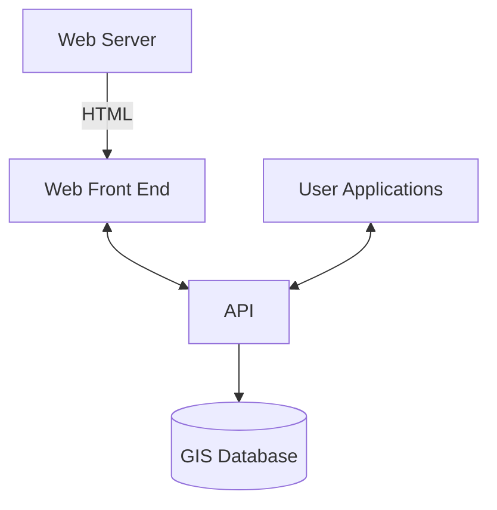
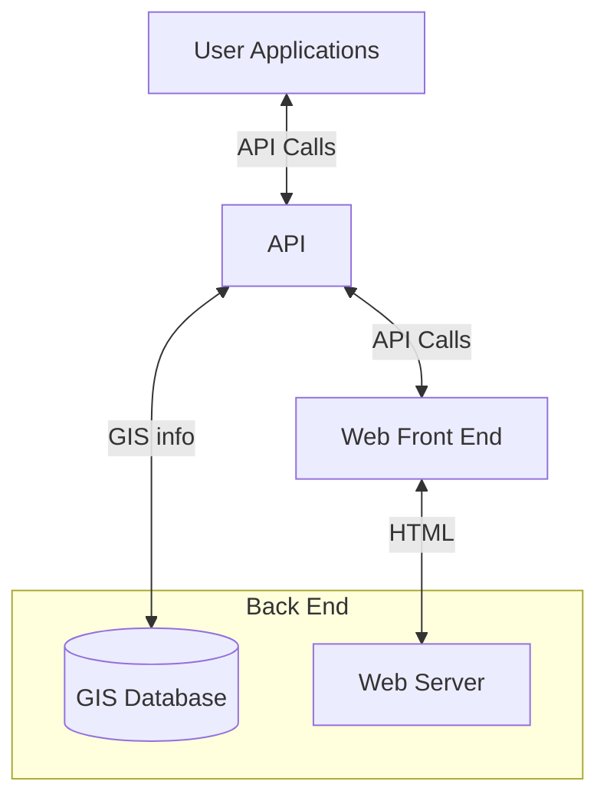

```mermaid
    flowchart TD
        DB@{ shape: cyl, label: "GIS Database" }
        WS[Web Server] --> |HTML| WFE[Web Front End]
        WFE <--> API
        UA[User Applications] <--> API
        API --> DB
```

```mermaid
    flowchart TD
        DB@{ shape: cyl, label: "GIS Database" }
        subgraph BD[Back End]
            DB
            WS[Web Server]
        end
        UA[User Applications] <-->|API Calls|API
        API <-->|GIS info|DB
        API <-->|API Calls|WFE[Web Front End]
        WFE <-->|HTML|WS
```