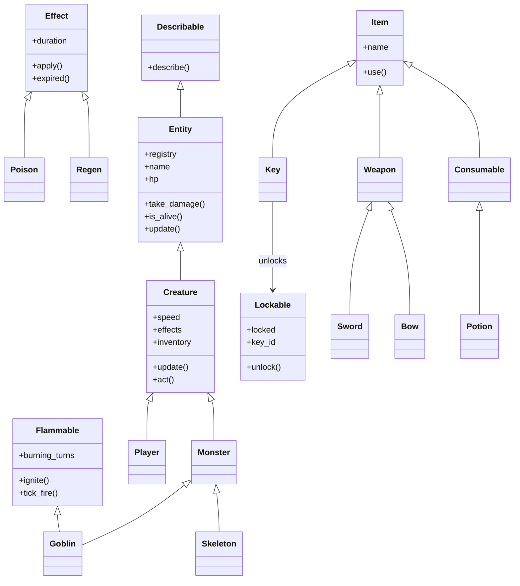

```mermaid
    classDiagram
        
        class Describable {
            +describe()
        }
        class Flammable {
            +burning_turns
            +ignite()
            +tick_fire()
        }
        class Lockable {
            +locked
            +key_id
            +unlock()
        }
        class Effect {
            +duration
            +apply()
            +expired()
        }
        class Item {
            +name
            +use()
        }
        class Entity {
            +registry
            +name
            +hp
            +take_damage()
            +is_alive()
            +update()
        }
        class Creature {
            +speed
            +effects
            +inventory
            +update()
            +act()
        }
        Describable <|-- Entity
        Entity <|-- Creature
        Creature <|-- Player
        Creature <|-- Monster
        Monster <|-- Goblin
        Flammable <|-- Goblin
        Monster <|-- Skeleton
        Effect <|-- Poison
        Effect <|-- Regen
        Item <|-- Key
        Item <|-- Weapon
        Weapon <|-- Sword
        Weapon <|-- Bow
        Item <|-- Consumable
        Consumable <|-- Potion

        Key --> Lockable : unlocks
```